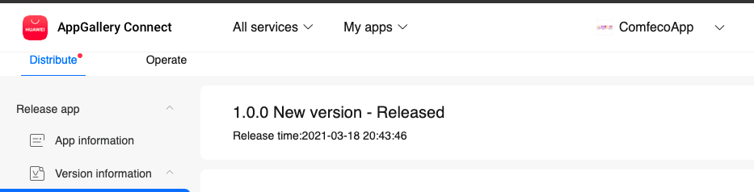
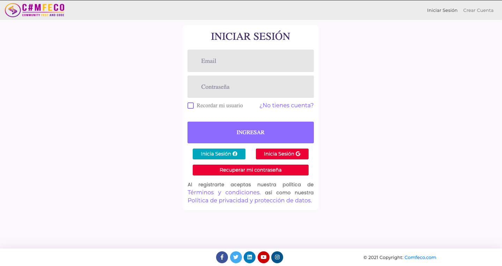
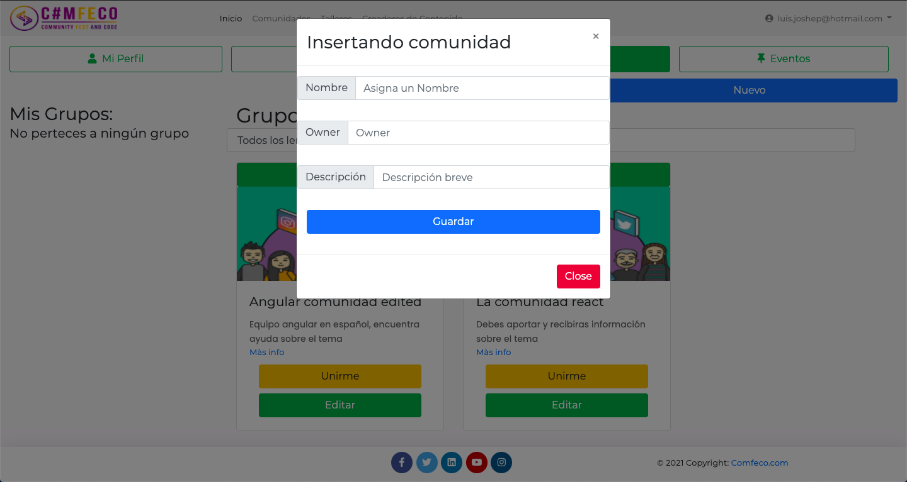

# Bienvenido a la propuesta oficial de la App COMFECO

Esta solución se basa en un proyecto de Angular +11 como Front-End y Firebase services como backend. Cuenta con los servicios de Firebase hosting en un ambiente de producción https://comfecoapp.firebaseapp.com/, la información se encuentra almacenada en firestore de firebase y se utilizan 3 servicios de autenticación:

Login con Firebase:
 
Login con Facebook:
 
Login con Google/Gmail:
 

# Versión QuickApp
Existe una versión de Huawei quickapp para la misma sin embargo aquí solo funcionara una cuenta que registres con correo electrónico, ni google auth ni facebook funcionan en la version 1.0 de esta app:

 

# Algunas pantallas de la aplicación
 
 
 
 

# ComfecoApp

This project was generated with [Angular CLI](https://github.com/angular/angular-cli) version 11.1.4.

## Development server

Run `ng serve` for a dev server. Navigate to `http://localhost:4200/`. The app will automatically reload if you change any of the source files.

## Code scaffolding

Run `ng generate component component-name` to generate a new component. You can also use `ng generate directive|pipe|service|class|guard|interface|enum|module`.

## Build

Run `ng build` to build the project. The build artifacts will be stored in the `dist/` directory. Use the `--prod` flag for a production build.

## Running unit tests

Run `ng test` to execute the unit tests via [Karma](https://karma-runner.github.io).

## Running end-to-end tests

Run `ng e2e` to execute the end-to-end tests via [Protractor](http://www.protractortest.org/).

## Further help

To get more help on the Angular CLI use `ng help` or go check out the [Angular CLI Overview and Command Reference](https://angular.io/cli) page.
